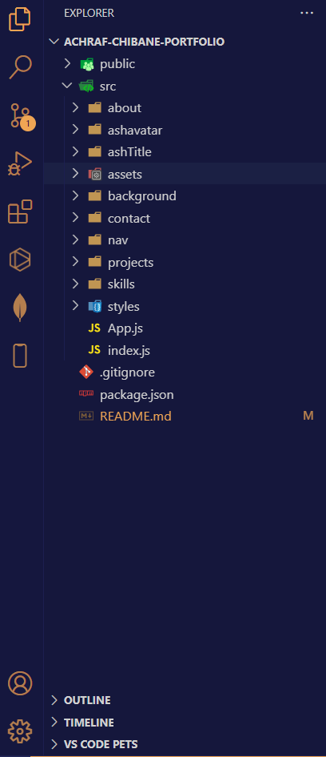

<div align="center">
  <h1>achraf-chibane-portfolio</h1>
  
</div>
<link rel="stylesheet" href="https://cdnjs.cloudflare.com/ajax/libs/font-awesome/6.1.0/css/all.min.css" integrity="sha384-jFJkzqmj3najsAm9piS5Jz5bO5zqWtDk5Q6j06Id7aR/qq5r5Ow5owF5CZIpEckF" crossorigin="anonymous">


## Table of Contents

- [Description](#description)
- [Screenshots](#screenshots)
- [Installation](#installation)
- [Usage](#usage)
- [Features](#Features)
- [Contributing](#contributing)
- [Tests](#tests)
- [Questions](#questions)


## Description

Welcome to my portfolio! This is a collection of my work as a web developer and designer. It showcases my skills, projects, and provides information about me.

## Screenshots
## Folder Structure <br>



## Screenshot of the Website :


## The following image shows  the About Me :


## The following image shows the Skills : 


## The following image shows The Projects :  


## The following image shows the Contact Me : 


## Installation
To run this website locally, follow these steps: <br>
1- Clone the repository to your local machine:
```
git@github.com:Ash0422/achraf-chibane-portfolio.git
```
 
2- Navigate to the project directory: 
~~~
cd achraf-chibane-portfolio
~~~ 

3- Install the project dependencies: <br>
~~~
npm install
~~~

4-Start the development server: <br>
~~~
npm start
~~~
or just check the Website on this link:   [Achraf Portfolio](https://achrafchibane.com)

## Usage

Feel free to use this portfolio project as a template for your own portfolio. You can customize it by adding your own projects, updating the content in the `src/data` directory, and adjusting the styling to match your personal preferences.


## Features
- **Responsive Design:** The portfolio is fully responsive and looks great on all devices.
- **Project Showcase:** You can see a variety of projects I've worked on, including web applications, websites, and more.
- **About Me:** Learn about my background, skills, and interests.
- **Contact:** Find ways to get in touch with me, including email and social media links.

## Contributing

If you'd like to contribute to this project, please open an issue or submit a pull request. Contributions and feedback are welcome!

## Tests
The website has been tested by the creator and it works fine.<br>
this application has been uploaded to github:  [Achraf's Portfolio GitHub](https://github.com/Ash0422/achraf-chibane-portfolio)<br>
this application has been deployed to a domain:  [Achraf's Portfolio Website](https://achrafchibane.com)


## Questions
For any additional questions, please contact me by email <i class="fas fa-envelope"></i> [chibane.tkd04@gmail.com](mailto:chibane.tkd04@gmail.com) or visit my GitHub profile <i class="fab fa-github"></i> [Ash0422](https://github.com/Ash0422).

